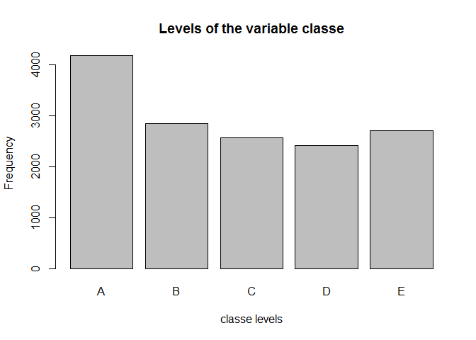
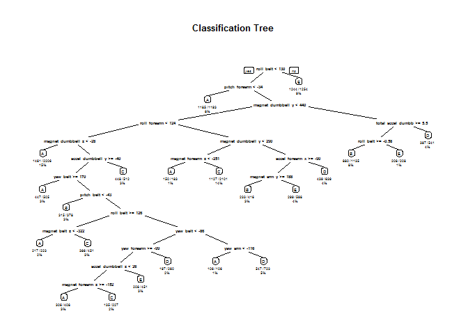

# Practical Machine Learning Prediction Assignment Writeup: Predict activity quality
30. January 2016  

##Background

Using devices such as Jawbone Up, Nike FuelBand, and Fitbit it is now possible to collect a large amount of data about personal activity relatively inexpensively. These type of devices are part of the quantified self movement – a group of enthusiasts who take measurements about themselves regularly to improve their health, to find patterns in their behavior, or because they are tech geeks. One thing that people regularly do is quantify how much of a particular activity they do, but they rarely quantify how well they do it. In this project, your goal will be to use data from accelerometers on the belt, forearm, arm, and dumbell of 6 participants. They were asked to perform barbell lifts correctly and incorrectly in 5 different ways.

More information is available from the website here: http://groupware.les.inf.puc-rio.br/har (see the section on the Weight Lifting Exercise Dataset).

In this project our goal is to predict the manner in which they did the exercise. This is the `classe` variable in the training set.

## Data sources

The data for this project come from this source: http://groupware.les.inf.puc-rio.br/har. If you use the document you create for this class for any purpose please cite them as they have been very generous in allowing their data to be used for this kind of assignment.

The training data for this project are available here: https://d396qusza40orc.cloudfront.net/predmachlearn/pml-training.csv
The test data are available here: https://d396qusza40orc.cloudfront.net/predmachlearn/pml-testing.csv

## Data description

The outcome variable is `classe`, a factor variable with 5 levels. For this data set, participants were asked to perform one set of 10 repetitions of the Unilateral Dumbbell Biceps Curl in 5 different fashions:

- exactly according to the specification (Class A)
- throwing the elbows to the front (Class B)
- lifting the dumbbell only halfway (Class C)
- lowering the dumbbell only halfway (Class D)
- throwing the hips to the front (Class E)

## Initial configuration

The initial configuration consists of loading some required packages and initializing some variables.


```r
#Data variables
training.file   <- './data/pml-training.csv'
test.cases.file <- './data/pml-testing.csv'
training.url    <- 'http://d396qusza40orc.cloudfront.net/predmachlearn/pml-training.csv'
test.cases.url  <- 'http://d396qusza40orc.cloudfront.net/predmachlearn/pml-testing.csv'

#Directories
if (!file.exists("data")){
  dir.create("data")
}

#R-Packages
IscaretInstalled <- require("caret")
```

```
## Loading required package: caret
```

```
## Warning: package 'caret' was built under R version 3.2.3
```

```
## Loading required package: lattice
## Loading required package: ggplot2
```

```
## Warning: package 'ggplot2' was built under R version 3.2.3
```

```r
if(!IscaretInstalled){
    install.packages("caret")
    library("caret")
    }

IsrandomForestInstalled <- require("randomForest")
```

```
## Loading required package: randomForest
```

```
## Warning: package 'randomForest' was built under R version 3.2.3
```

```
## randomForest 4.6-12
## Type rfNews() to see new features/changes/bug fixes.
## 
## Attaching package: 'randomForest'
## 
## The following object is masked from 'package:ggplot2':
## 
##     margin
```

```r
if(!IsrandomForestInstalled){
    install.packages("randomForest")
    library("randomForest")
    }

IsRpartInstalled <- require("rpart")
```

```
## Loading required package: rpart
```

```
## Warning: package 'rpart' was built under R version 3.2.3
```

```r
if(!IsRpartInstalled){
    install.packages("rpart")
    library("rpart")
    }

IsRpartPlotInstalled <- require("rpart.plot")
```

```
## Loading required package: rpart.plot
```

```
## Warning: package 'rpart.plot' was built under R version 3.2.3
```

```r
if(!IsRpartPlotInstalled){
    install.packages("rpart.plot")
    library("rpart.plot")
    }
        
# Set seed for reproducibility
set.seed(1568)
```

## Data processing
We will download the data than basic transformations and cleanup will be performed, so that `NA` values are omitted. Irrelevant columns such as `user_name`, `raw_timestamp_part_1`, `raw_timestamp_part_2`, `cvtd_timestamp`, `new_window`, and  `num_window` (columns 1 to 7) will be removed in the subset.

The `pml-training.csv` data is used to devise training and testing sets.
The `pml-test.csv` data is used to predict and answer the 20 questions based on the trained model.


```r
# Download the datasets
download.file(training.url, training.file)
download.file(test.cases.url,test.cases.file )

# Clean data
training        <-read.csv(training.file, na.strings=c("NA","#DIV/0!", ""))
testing         <-read.csv(test.cases.file , na.strings=c("NA", "#DIV/0!", ""))
training        <-training[,colSums(is.na(training)) == 0]
testing         <-testing[,colSums(is.na(testing)) == 0]

# Subset data
training        <-training[,-c(1:7)]
testing         <-testing[,-c(1:7)]
```

## Cross-validation
We will perform cross-validation by splitting the training data in training (75%) and testing (25%) data.


```r
subSamples      <- createDataPartition(y=training$classe, p=0.75, list=FALSE)
subTraining     <- training[subSamples, ] 
subTesting      <- training[-subSamples, ]
```

## Expected out-of-sample error
The expected out-of-sample error will correspond to the quantity: 1-accuracy in the cross-validation data. Accuracy is the proportion of correct classified observation over the total sample in the subTesting data set. Expected accuracy is the expected accuracy in the out-of-sample data set (i.e. original testing data set). Thus, the expected value of the out-of-sample error will correspond to the expected number of misclassified observations/total observations in the Test data set, which is the quantity: 1-accuracy found from the cross-validation data set.

## Exploratory analysis
The variable `classe` contains 5 levels. The plot of the outcome variable shows the frequency of each levels in the subTraining data.


```r
plot(subTraining$classe, col="gray", main="Levels of the variable classe", xlab="classe levels", ylab="Frequency")
```

 

The plot above shows that Level A is the most frequent classe. D appears to be the least frequent one.

## Prediction models
In this section a decision tree and random forest will be applied to the data.

### Decision tree

```r
# Fit model
modFitDT        <- rpart(classe ~ ., data=subTraining, method="class")

# Perform prediction
predictDT       <- predict(modFitDT, subTesting, type = "class")

# Plot result
rpart.plot(modFitDT, main="Classification Tree", extra=102, under=TRUE, faclen=0)
```

 

Following confusion matrix shows the errors of the prediction algorithm.


```r
confusionMatrix(predictDT, subTesting$classe)
```

```
## Confusion Matrix and Statistics
## 
##           Reference
## Prediction    A    B    C    D    E
##          A 1287  185   26   77   32
##          B   29  474   68   37   63
##          C   31  124  687  129  118
##          D   20   78   54  498   45
##          E   28   88   20   63  643
## 
## Overall Statistics
##                                           
##                Accuracy : 0.7319          
##                  95% CI : (0.7192, 0.7442)
##     No Information Rate : 0.2845          
##     P-Value [Acc > NIR] : < 2.2e-16       
##                                           
##                   Kappa : 0.6592          
##  Mcnemar's Test P-Value : < 2.2e-16       
## 
## Statistics by Class:
## 
##                      Class: A Class: B Class: C Class: D Class: E
## Sensitivity            0.9226  0.49947   0.8035   0.6194   0.7137
## Specificity            0.9088  0.95019   0.9007   0.9520   0.9503
## Pos Pred Value         0.8009  0.70641   0.6309   0.7165   0.7637
## Neg Pred Value         0.9672  0.88779   0.9560   0.9273   0.9365
## Prevalence             0.2845  0.19352   0.1743   0.1639   0.1837
## Detection Rate         0.2624  0.09666   0.1401   0.1015   0.1311
## Detection Prevalence   0.3277  0.13683   0.2221   0.1417   0.1717
## Balanced Accuracy      0.9157  0.72483   0.8521   0.7857   0.8320
```

### Random forest

```r
# Fit model
modFitRF        <- randomForest(classe ~ ., data=subTraining, method="class")

# Perform prediction
predictRF       <- predict(modFitRF, subTesting, type = "class")
```

Following confusion matrix shows the errors of the prediction algorithm.


```r
confusionMatrix(predictRF, subTesting$classe)
```

```
## Confusion Matrix and Statistics
## 
##           Reference
## Prediction    A    B    C    D    E
##          A 1393    4    0    0    0
##          B    2  945    1    0    0
##          C    0    0  854   12    0
##          D    0    0    0  791    0
##          E    0    0    0    1  901
## 
## Overall Statistics
##                                           
##                Accuracy : 0.9959          
##                  95% CI : (0.9937, 0.9975)
##     No Information Rate : 0.2845          
##     P-Value [Acc > NIR] : < 2.2e-16       
##                                           
##                   Kappa : 0.9948          
##  Mcnemar's Test P-Value : NA              
## 
## Statistics by Class:
## 
##                      Class: A Class: B Class: C Class: D Class: E
## Sensitivity            0.9986   0.9958   0.9988   0.9838   1.0000
## Specificity            0.9989   0.9992   0.9970   1.0000   0.9998
## Pos Pred Value         0.9971   0.9968   0.9861   1.0000   0.9989
## Neg Pred Value         0.9994   0.9990   0.9998   0.9968   1.0000
## Prevalence             0.2845   0.1935   0.1743   0.1639   0.1837
## Detection Rate         0.2841   0.1927   0.1741   0.1613   0.1837
## Detection Prevalence   0.2849   0.1933   0.1766   0.1613   0.1839
## Balanced Accuracy      0.9987   0.9975   0.9979   0.9919   0.9999
```

## The Conclusion

### Result

The confusion matrices show, that the Random Forest algorithm performs better than decision trees. The accuracy for the Random Forest model was 0.995 (95% CI: (0.993, 0.997)) compared to 0.739 (95% CI: (0.727, 0.752)) for Decision Tree model. The random Forest model is choosen.

### Expected out-of-sample error
The expected out-of-sample error is estimated at 0.005, or 0.5%. The expected out-of-sample error is calculated as 1 - accuracy for predictions made against the cross-validation set. Our Test data set comprises 20 cases. With an accuracy above 99% on our cross-validation data, we can expect that very few, or none, of the test samples will be misclassified.

## Course Project Prediction Quiz
The results of my machine learning algorithm to the 20 test cases available in the test dataset.


```r
# Perform prediction
predictSubmission <- predict(modFitRF, testing, type="class")
predictSubmission
```

```
##  1  2  3  4  5  6  7  8  9 10 11 12 13 14 15 16 17 18 19 20 
##  B  A  B  A  A  E  D  B  A  A  B  C  B  A  E  E  A  B  B  B 
## Levels: A B C D E
```
